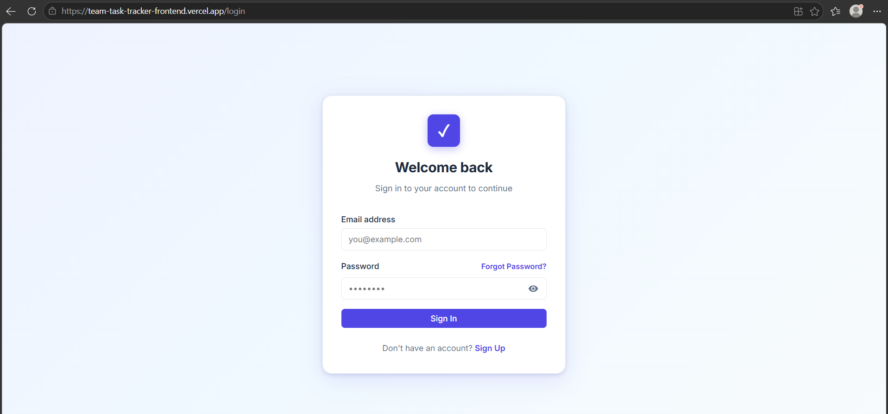
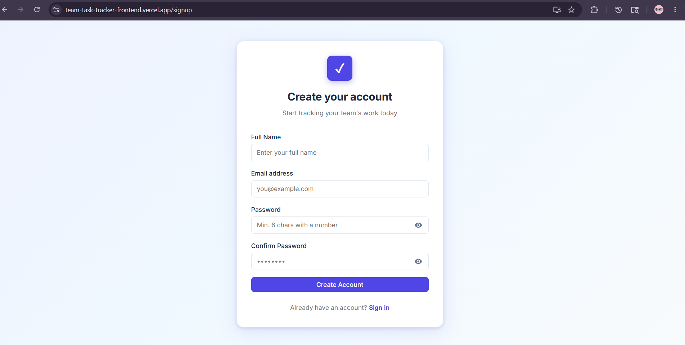
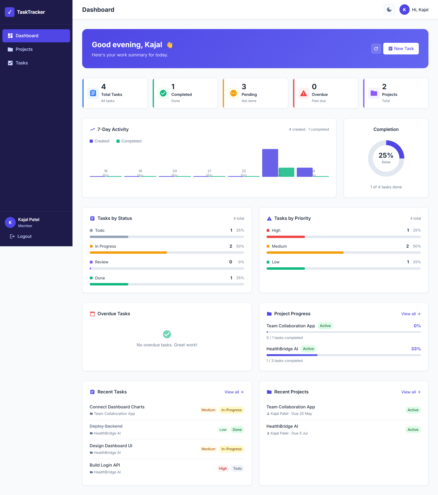
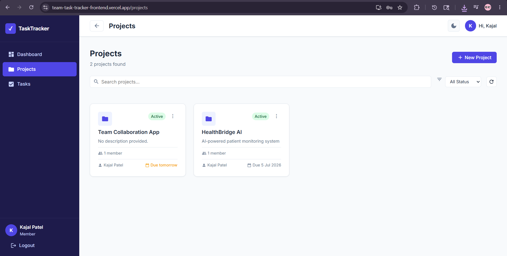
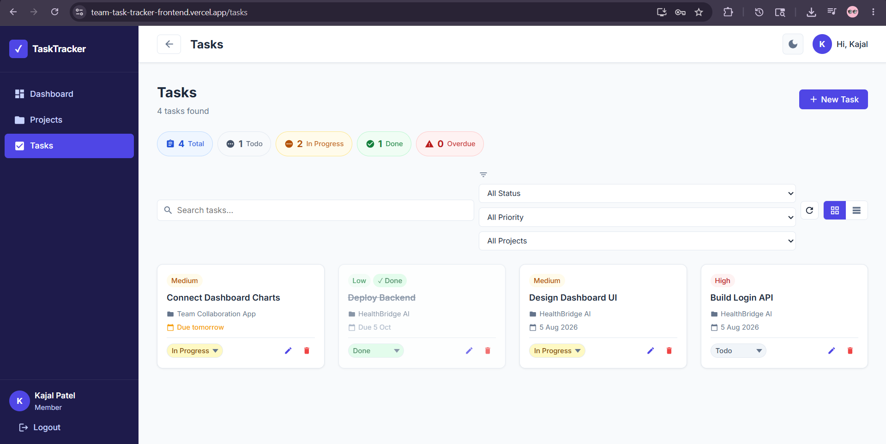
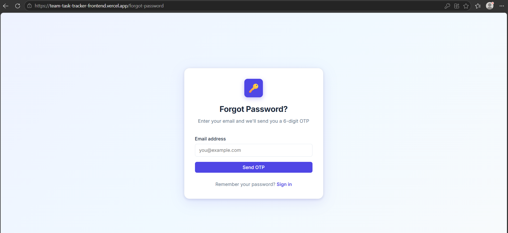

# 📋 Team Task Tracker

<div align="center">


**A full-stack MERN project management application for teams to create, assign, and track tasks across projects — with JWT authentication, OTP-based password reset, and a real-time dashboard.**

</div>

---

## 🌐 Live Deployment

| Service | URL |
|---------|-----|
| 🖥️ Frontend (Vercel) | [team-task-tracker-frontend.vercel.app](https://team-task-tracker-frontend.vercel.app) |
| ⚙️ Backend API (Render) | [team-task-tracker-backend-9ugk.onrender.com](https://team-task-tracker-backend-9ugk.onrender.com) |
| 📁 Frontend Repository | [github.com/Kajal-ctrlF/team-task-tracker-frontend](https://github.com/Kajal-ctrlF/team-task-tracker-frontend) |
| 📁 Backend Repository | [github.com/Kajal-ctrlF/team-task-tracker-backend](https://github.com/Kajal-ctrlF/team-task-tracker-backend) |

> **Note:** The backend is hosted on Render's free tier. The first request may take 30–60 seconds to wake up the server.

---

## 📸 Screenshots

### 🔐 Authentication

<table>
  <tr>
    <td align="center" width="50%">
      <strong>Login Page</strong><br/><br/>
      
    </td>
    <td align="center" width="50%">
      <strong>Signup Page</strong><br/><br/>
      
    </td>
  </tr>
</table>

### 📊 Dashboard

<table>
  <tr>
    <td align="center" width="100%">
      <strong>Dashboard — Stats, Activity & Recent Items</strong><br/><br/>
      
    </td>
  </tr>
</table>

### 📁 Projects & ✅ Tasks

<table>
  <tr>
    <td align="center" width="50%">
      <strong>Projects Page</strong><br/><br/>
      
    </td>
    <td align="center" width="50%">
      <strong>Tasks Page</strong><br/><br/>
      
    </td>
  </tr>
</table>

### 🔑 Forgot Password / OTP Flow

<table>
  <tr>
    <td align="center" width="100%">
      <strong>OTP Verification</strong><br/><br/>
      
    </td>
  </tr>
</table>

---

## 📌 Project Overview

**Team Task Tracker** is a production-ready MERN stack web application that enables teams to manage projects and tasks efficiently. It features a clean, responsive UI with dark/light mode, real-time dashboard statistics, and a complete authentication system including OTP-based password reset via email.

This project was built as a machine test / internship project demonstrating full-stack development skills including REST API design, JWT authentication, MongoDB aggregation pipelines, and React state management.

---

## ✨ Features

### 🔐 Authentication
- User registration with field-level inline validation
- JWT-based login with token expiry handling
- Forgot Password with 6-digit OTP via email (Brevo API)
- OTP expiry in 10 minutes with countdown timer on frontend
- OTP hashed with bcrypt before storing in DB
- Secure password reset with `resetOtpVerified` gate
- Persistent login via `localStorage`

### 📊 Dashboard
- Summary stats: Total Tasks, Completed, Pending, Overdue, Projects
- Task breakdown by status and priority (horizontal bar charts — pure CSS)
- 7-day activity feed (tasks created vs completed per day)
- Per-project task completion progress bars
- Overdue tasks list with days overdue count
- Recent tasks and recent projects sections
- Skeleton loading states

### 📁 Projects
- Full CRUD (Create, Read, Update, Delete)
- Status: Active / Completed / Archived
- Search by title, filter by status
- Cascade delete — removes all tasks when project is deleted
- Deadline tracking with overdue indicators
- 3-dot dropdown menu (Edit / Delete) — owner only

### ✅ Tasks
- Full CRUD for tasks
- Assign tasks to project members
- Status: Todo / In Progress / Review / Done
- Priority: Low / Medium / High
- Due date with overdue detection and color coding
- Inline status update via dropdown (no page reload)
- Dedicated `PATCH /tasks/:id/status` endpoint
- Search by title/description (MongoDB text index)
- Filter by status, priority, project
- Pagination support
- Grid view and Table view toggle (preference saved in localStorage)

### 🎨 UI/UX
- Dark / Light mode toggle (saved in localStorage)
- Responsive design (mobile + desktop)
- Smooth page transitions (Framer Motion)
- Toast notifications
- Password strength indicator on signup
- OTP input boxes with auto-focus and paste support
- Confirm dialog for destructive actions

---

## 🛠️ Tech Stack

### Backend

| Technology | Purpose |
|-----------|---------|
| Node.js | Server-side JavaScript runtime |
| Express.js | Web framework for building REST APIs |
| MongoDB Atlas | Cloud-hosted NoSQL database |
| Mongoose | MongoDB schema and data modeling |
| JSON Web Token (JWT) | User authentication and authorization |
| bcryptjs | Secure password and OTP hashing |
| Brevo (sib-api-v3-sdk) | Sending OTP emails via HTTP API |
| express-validator | Request input validation |
| dotenv | Managing environment variables |
| CORS | Allowing cross-origin requests from frontend |

### Frontend

| Technology | Purpose |
|-----------|---------|
| React.js | Building the user interface |
| React Router v6 | Client-side page navigation |
| Axios | Making HTTP requests to the backend |
| Framer Motion | Page transition animations |
| React Hot Toast | In-app notifications |
| React Icons | Icon library |
| Context API | Managing global state (auth + theme) |

### Infrastructure

| Service | Purpose |
|---------|---------|
| MongoDB Atlas | Cloud database hosting |
| Render | Backend deployment |
| Vercel | Frontend deployment |
| GitHub | Version control |

---

## 🚀 Getting Started (Local Setup)

### Prerequisites
- Node.js >= 18.0.0
- npm >= 9.0.0
- MongoDB Atlas account (free tier)
- Brevo account (free tier) for OTP emails

### 1. Clone the repositories

```bash
# Backend
git clone https://github.com/Kajal-ctrlF/team-task-tracker-backend.git

# Frontend
git clone https://github.com/Kajal-ctrlF/team-task-tracker-frontend.git
```

### 2. Backend Setup

```bash
cd team-task-tracker-backend
npm install
```

Create `.env` in the backend root:

```env
PORT=5000
NODE_ENV=development
MONGO_URI=mongodb+srv://<username>:<password>@cluster0.xxxxx.mongodb.net/team-task-tracker?retryWrites=true&w=majority
JWT_SECRET=your_super_secret_jwt_key
JWT_EXPIRE=7d
CLIENT_URL=http://localhost:3000
BREVO_API_KEY=your_brevo_api_key
EMAIL_FROM=your_email@gmail.com
```

```bash
npm run dev
# ✅ Server running on http://localhost:5000
```

### 3. Frontend Setup

```bash
cd team-task-tracker-frontend
npm install
```

Create `.env` in the frontend root:

```env
REACT_APP_API_URL=http://localhost:5000/api
CI=false
```

```bash
npm start
# ✅ App running on http://localhost:3000
```

---

## 🔑 Environment Variables Reference

### Backend

| Variable | Description | Required |
|----------|-------------|----------|
| `PORT` | Server port (default: 5000) | No |
| `NODE_ENV` | `development` or `production` | Yes |
| `MONGO_URI` | MongoDB Atlas connection string | Yes |
| `JWT_SECRET` | Secret key for signing JWT tokens | Yes |
| `JWT_EXPIRE` | Token expiry (e.g. `7d`) | Yes |
| `CLIENT_URL` | Frontend URL for CORS | Yes |
| `BREVO_API_KEY` | Brevo API key for sending OTP emails | Yes |
| `EMAIL_FROM` | Sender email address | Yes |

### Frontend

| Variable | Description | Required |
|----------|-------------|----------|
| `REACT_APP_API_URL` | Backend API base URL | Yes |
| `CI` | Set to `false` to prevent build failures | Yes |

---

## 📡 API Reference

**Base URL**
```
Local:      http://localhost:5000/api
Production: https://team-task-tracker-backend-9ugk.onrender.com/api
```

All private routes require:
```
Authorization: Bearer <jwt_token>
```

### Auth

| Method | Endpoint | Access | Description |
|--------|----------|--------|-------------|
| `POST` | `/auth/register` | Public | Register new user |
| `POST` | `/auth/login` | Public | Login, returns JWT |
| `GET` | `/auth/me` | Private | Get current user profile |
| `PUT` | `/auth/me` | Private | Update profile |
| `POST` | `/auth/forgot-password` | Public | Send 6-digit OTP to email |
| `POST` | `/auth/verify-otp` | Public | Verify OTP code |
| `POST` | `/auth/reset-password` | Public | Set new password after OTP verified |

### Projects

| Method | Endpoint | Access | Description |
|--------|----------|--------|-------------|
| `GET` | `/projects` | Private | List projects (`?search=` `?status=`) |
| `POST` | `/projects` | Private | Create project |
| `GET` | `/projects/:id` | Private | Get single project |
| `PUT` | `/projects/:id` | Private (owner) | Update project |
| `DELETE` | `/projects/:id` | Private (owner) | Delete project and all its tasks |

### Tasks

| Method | Endpoint | Access | Description |
|--------|----------|--------|-------------|
| `GET` | `/tasks` | Private | List tasks (`?status=` `?priority=` `?projectId=` `?search=` `?page=` `?limit=`) |
| `POST` | `/tasks` | Private | Create task |
| `GET` | `/tasks/:id` | Private | Get single task |
| `PUT` | `/tasks/:id` | Private | Update task |
| `PATCH` | `/tasks/:id/status` | Private | Update status only |
| `DELETE` | `/tasks/:id` | Private | Delete task |

### Dashboard

| Method | Endpoint | Access | Description |
|--------|----------|--------|-------------|
| `GET` | `/dashboard` | Private | Summary stats, breakdowns, recent items |
| `GET` | `/dashboard/activity` | Private | 7-day activity data |
| `GET` | `/dashboard/overdue` | Private | Overdue tasks with `daysOverdue` |

---

## 📝 Sample Requests & Responses

<details>
<summary><strong>POST /auth/register</strong></summary>

**Request:**
```json
{
  "name": "Kajal Patel",
  "email": "kajal@example.com",
  "password": "Test1234"
}
```

**Response `201`:**
```json
{
  "success": true,
  "message": "Account created successfully",
  "data": {
    "_id": "64abc123...",
    "name": "Kajal Patel",
    "email": "kajal@example.com",
    "role": "member",
    "token": "eyJhbGciOiJIUzI1NiJ9..."
  }
}
```
</details>

<details>
<summary><strong>POST /auth/login</strong></summary>

**Request:**
```json
{
  "email": "kajal@example.com",
  "password": "Test1234"
}
```

**Response `200`:**
```json
{
  "success": true,
  "message": "Login successful",
  "data": {
    "_id": "64abc123...",
    "name": "Kajal Patel",
    "email": "kajal@example.com",
    "role": "member",
    "token": "eyJhbGciOiJIUzI1NiJ9..."
  }
}
```
</details>

<details>
<summary><strong>POST /tasks</strong></summary>

**Request:**
```json
{
  "title": "Fix login bug",
  "project": "64proj123...",
  "priority": "high",
  "status": "todo",
  "dueDate": "2025-06-30"
}
```

**Response `201`:**
```json
{
  "success": true,
  "message": "Task created successfully",
  "data": {
    "_id": "64task123...",
    "title": "Fix login bug",
    "status": "todo",
    "priority": "high",
    "project": { "title": "Website Redesign" },
    "createdBy": { "name": "Kajal Patel" }
  }
}
```
</details>

---

## 🔐 Authentication Flow

```
LOGIN / REGISTER
  Client → POST /auth/login (email + password)
         → Server verifies credentials
         → JWT generated (expires: 7 days)
         → Token stored in localStorage
         → Sent with every request: Authorization: Bearer <token>

PROTECTED ROUTE
  Request → protect middleware → jwt.verify(token)
          → Decode user ID → fetch user from DB
          → Attach to req.user → controller runs
```

---

## 🔑 Forgot Password + OTP Flow

```
Step 1 — POST /auth/forgot-password  { email }
  → Generate 6-digit OTP
  → Hash OTP with bcrypt
  → Save hash + expiry (10 min) to DB
  → Send OTP via Brevo email API

Step 2 — POST /auth/verify-otp  { email, otp }
  → Check OTP not expired
  → bcrypt.compare(entered, stored hash)
  → If valid → set resetOtpVerified = true

Step 3 — POST /auth/reset-password  { email, newPassword }
  → Check resetOtpVerified === true
  → Update password (auto-hashed by pre-save hook)
  → Clear all OTP fields from DB
```

---

## 🧪 Basic Test Cases

| # | Test | Expected Result |
|---|------|----------------|
| 1 | Register with valid data | `201` — account created, JWT returned |
| 2 | Register with existing email | `400` — "Account already exists with this email" |
| 3 | Login with correct credentials | `200` — JWT token returned |
| 4 | Login with wrong password | `401` — "Invalid email or password" |
| 5 | Access protected route without token | `401` — "Access denied" |
| 6 | Create project with valid data | `201` — project created |
| 7 | Create task without project | `422` — "Project ID is required" |
| 8 | Delete project (non-owner) | `403` — "Only the project owner can delete it" |
| 9 | Send OTP to unregistered email | `200` — generic message (prevents enumeration) |
| 10 | Submit wrong OTP | `400` — "Incorrect OTP" |
| 11 | Submit expired OTP | `400` — "OTP has expired" |
| 12 | Reset password without OTP | `403` — "Please verify your OTP first" |
| 13 | Filter tasks by status=done | `200` — only completed tasks |
| 14 | Dashboard with no tasks | `200` — all counts return 0 |

---

## 📁 Folder Structure

```
team-task-tracker/
├── backend/
│   ├── config/db.js
│   ├── controllers/
│   │   ├── authController.js
│   │   ├── projectController.js
│   │   ├── taskController.js
│   │   └── dashboardController.js
│   ├── middleware/
│   │   ├── authMiddleware.js
│   │   ├── errorMiddleware.js
│   │   └── validate.js
│   ├── models/
│   │   ├── User.js
│   │   ├── Project.js
│   │   └── Task.js
│   ├── routes/
│   │   ├── authRoutes.js
│   │   ├── projectRoutes.js
│   │   ├── taskRoutes.js
│   │   └── dashboardRoutes.js
│   ├── utils/
│   │   ├── generateToken.js
│   │   └── sendEmail.js
│   ├── server.js
│   └── package.json
│
└── frontend/
    ├── screenshots/
    ├── src/
    │   ├── api/
    │   ├── components/
    │   │   ├── common/
    │   │   ├── layout/
    │   │   ├── projects/
    │   │   ├── routing/
    │   │   └── tasks/
    │   ├── context/
    │   ├── pages/
    │   └── styles/
    ├── vercel.json
    └── package.json
```

---

## 🌐 Deployment Guide

### Backend → Render

1. Push backend to GitHub
2. Go to [render.com](https://render.com) → **New Web Service**
3. Connect the backend repository
4. Set **Build Command:** `npm install` and **Start Command:** `node server.js`
5. Add all environment variables
6. Deploy

### Frontend → Vercel

1. Push frontend to GitHub
2. Go to [vercel.com](https://vercel.com) → **New Project**
3. Import the frontend repository
4. Add `REACT_APP_API_URL` and `CI=false` in environment variables
5. Deploy

### Database → MongoDB Atlas

1. Create free cluster at [mongodb.com/atlas](https://www.mongodb.com/atlas)
2. Create database user and allow all IPs (`0.0.0.0/0`)
3. Copy connection string into `MONGO_URI`

---

## 🔮 Future Improvements

- [ ] Real-time notifications using Socket.io
- [ ] Drag-and-drop Kanban board
- [ ] Task comments
- [ ] Team invitation via email
- [ ] Export tasks to CSV
- [ ] Google OAuth login
- [ ] Calendar view for deadlines

---

## 👩‍💻 Author

**Kajal Patel**

[](https://github.com/Kajal-ctrlF)

---

## 📄 License

This project is built for educational and internship demonstration purposes.

---

<div align="center">

Made with ❤️ using the MERN Stack

</div>
